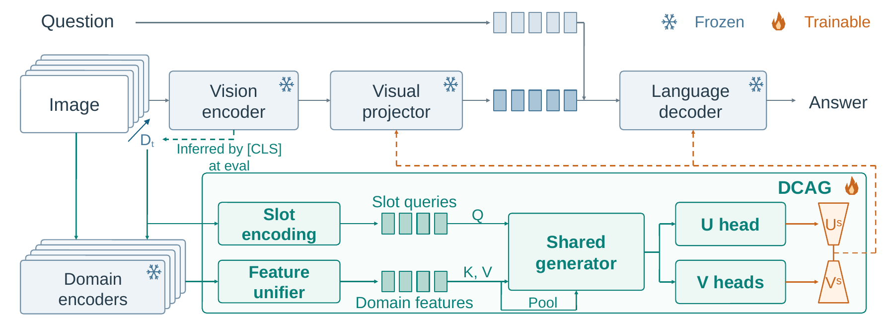

# DCAG

Official implementation of **Domain-Conditioned Adapter Generation for Multimodal Continual Instruction Tuning**.

## Abstract

Multimodal continual instruction tuning aims to acquire knowledge from new domains while retaining previously learned capabilities, without replaying past training data. Existing approaches face a trade-off: parameter-sharing methods struggle to adapt to specialized domains with substantial distribution shift, whereas allocating separate parameters to each domain incurs growing training parameter cost with every new task. To address these issues, we propose DCAG, a compact shared generator that produces low-rank residuals for domain incremental continual adaptation. Conditioned on domain identity and features extracted by frozen domain encoders, the generator aggregates domain knowledge into per-sample low-rank residual updates for both the visual projector and the language decoder. On the five-domain MLLM-DCL benchmark, DCAG achieves final average accuracies of 69.08% and 68.40% on LLaVA-1.5-7B and InternVL-Chat, respectively, outperforming all parameter-sharing baselines and approaching the performance of domain-isolated method MR-LoRA with 45% fewer learned parameters. Positive backward transfer on both backbones further supports the benefits of shared, domain-conditioned adaptation.

## Overview



DCAG conditions a shared adapter generator on domain identity and features from frozen domain encoders. Slot-aware cross-attention and adaptive layer normalization produce sample-specific low-rank factors for the visual projector and language decoder. Task output slices, domain residuals, historical subspace projection, and prototype preservation support continual adaptation without replaying past training examples.

The LLaVA-1.5-7B pipeline follows **RS → Med → AD → Sci → Fin** on MLLM-DCL. Model weights and datasets are prepared separately.

## Repository structure

```text
DCAG/
├── README.md
├── pyproject.toml                 # Package and dependency definitions
├── LICENSE
├── THIRD_PARTY_NOTICES.md
├── assets/
│   └── architecture.png          # Method overview
├── configs/
│   ├── model.json                # Base model and domain-encoder paths
│   ├── data/                     # Train/test paths for the five domains
│   ├── train/                    # Sequential task1–task5 configurations
│   ├── eval.json                 # Routing mode and evaluation output
│   └── zero2.json                # DeepSpeed ZeRO-2 configuration
├── llava/
│   ├── model/
│   │   ├── dcag.py               # Generator, subspaces, slices and preservation
│   │   ├── builder.py            # Model and adapter checkpoint loading
│   │   ├── language_model/       # DCAG integration with the language decoder
│   │   ├── multimodal_encoder/   # Frozen LLaVA vision tower
│   │   └── multimodal_projector/ # Visual projection layers
│   ├── train/                    # Training, optimizer groups and state saving
│   └── eval/                     # Domain routing, inference and benchmark metrics
├── domain_encoders/
│   ├── rs/                       # Remote-sensing ViT features
│   ├── ad/                       # GeoMIM six-view features
│   ├── sci/                      # Pix2Struct features
│   └── fin/                      # CandleFusion ViT features
├── scripts/
│   ├── prepare_model.py          # Configure local LLaVA model paths
│   ├── build_router_prototypes.py
│   ├── train.py                  # Single-stage or sequential training
│   └── evaluate.py               # Five-domain evaluation
└── tests/                        # CPU checks for core continual-learning behavior
```

PubMedCLIP is loaded through Transformers in `llava/model/dcag.py`. All relative paths in configuration files resolve from this repository's root. Absolute paths and environment variables are also supported.

## Installation

Use Linux, Python 3.10, and NVIDIA GPUs. The dependency configuration uses PyTorch 2.0.1 and Transformers 4.31.0. Create a separate environment because this package includes its own `llava` implementation.

```bash
conda create -n dcag python=3.10 -y
conda activate dcag
cd DCAG
python -m pip install --upgrade pip
python -m pip install torch==2.0.1 torchvision==0.15.2 --index-url https://download.pytorch.org/whl/cu118
python -m pip install -e ".[train]"
python -m pip install flash-attn==2.3.3 --no-build-isolation
```

FlashAttention compilation requires a compatible CUDA toolkit and compiler. The training entrypoint uses FlashAttention; core CPU tests do not require it.

## Model preparation

Download the base model, its tokenizer, and encoder checkpoints from their upstream sources. Set their local paths in `configs/model.json`.

| Component | Source | Default local path |
|---|---|---|
| LLaVA-1.5-7B | [LLaVA checkpoint](https://huggingface.co/liuhaotian/llava-v1.5-7b) | `checkpoints/llava-v1.5-7b/` |
| CLIP ViT-L/14-336 | [CLIP checkpoint](https://huggingface.co/openai/clip-vit-large-patch14-336) | `checkpoints/clip-vit-large-patch14-336/` |
| RS: RVSA ViT-B pretraining | [Remote-Sensing-RVSA](https://github.com/ViTAE-Transformer/Remote-Sensing-RVSA) | `checkpoints/domains/rs/vit-b-checkpoint-1599.pth` |
| Med: PubMedCLIP | [PubMedCLIP ViT-B/32](https://huggingface.co/flaviagiammarino/pubmed-clip-vit-base-patch32) | `checkpoints/domains/pubmedclip/` |
| AD: GeoMIM Swin-Base | [GeoMIM](https://github.com/Sense-X/GeoMIM) | `checkpoints/domains/ad/geomim_base.pth` |
| Sci: Pix2Struct-base | [Pix2Struct](https://huggingface.co/google/pix2struct-base) | `checkpoints/domains/pix2struct-base/` |
| Fin: CandleFusion | [CandleFusion](https://huggingface.co/tuankg1028/candlefusion) | `checkpoints/domains/candlefusion/` |

For RS, use the ViT-B MAE pretraining checkpoint, not a downstream detection checkpoint. PubMedCLIP requires a Transformers CLIP configuration with vision width 768. The CandleFusion adapter reads `vit.*` weights from `pytorch_model.bin` and a ViT configuration in `config.json`; put the ViT-B/16-224 configuration in that directory if the downloaded configuration describes the full multimodal model. Keep the original multimodal configuration under a different filename.

Prepare the local LLaVA configuration after setting these paths:

```bash
python scripts/prepare_model.py
```

This updates the vision/text tower paths in the downloaded model's `config.json` and removes inactive sampling settings from `generation_config.json`. The pretrained projector is loaded from the full LLaVA checkpoint. To load a separate projector file, add an `mm_projector` path to `configs/model.json`.

## Data preparation

Follow [MCITlib](https://github.com/Ghy0501/MCITlib) for the MLLM-DCL benchmark data and preprocessing. Preserve the benchmark splits and question IDs. Each domain has a separate configuration under `configs/data/`:

```text
data/
├── RS/     # RSVQA
├── Med/    # PathVQA
├── AD/     # DriveLM
├── Sci/    # AI2D, SciVerse, MapQA and TQA
└── Fin/    # StockQA
```

Each directory contains `train.json`, `test.json`, and images (possibly in subdirectories). The `image` field is relative to `train_folder` or `test_folder` in the data configuration. Both annotation files are JSON arrays.

Training record:

```json
{
  "id": "sample_001",
  "image": "images/sample_001.jpg",
  "conversations": [
    {"from": "human", "value": "<image>\nWhat is shown in the image?"},
    {"from": "gpt", "value": "The answer."}
  ]
}
```

Evaluation record:

```json
{
  "question_id": "sample_001",
  "image": "images/sample_001.jpg",
  "text": "What is shown in the image?",
  "answer": "The answer."
}
```

Driving images use the benchmark's 2×3 six-view mosaic. Preserve the original science image names because its evaluator selects dataset-specific scoring rules from the filename.

## Training

The supplied configurations use two GPUs with effective batch size 16. Epoch counts are 1/3/1/2/1 for RS/Med/AD/Sci/Fin. Adjust `gpu_num`, `batch_size`, and `grad_acc` together when changing hardware:

```text
effective batch size = gpu_num × batch_size × grad_acc
```

Inspect the generated commands without loading data or models:

```bash
python scripts/train.py --gpus 0,1 --dry-run
```

Train all five domains sequentially:

```bash
python scripts/train.py --gpus 0,1
```

Train only the first stage, or continue from a completed stage:

```bash
python scripts/train.py --start-task 1 --end-task 1 --gpus 0,1
python scripts/train.py --start-task 2 --end-task 5 --gpus 0,1
```

Outputs are written to `outputs/task1/` through `outputs/task5/`. Each later stage loads `previous_model` from its configuration. Starting from task 2 or later requires the preceding completed checkpoint. A nonempty output directory is rejected to prevent accidental reuse. These commands continue across domain boundaries; they do not resume an interrupted optimizer step.

Checkpoints contain the DCAG configuration, learned weights, and continual-learning state, including historical subspaces, prototypes, and frozen task slices. Use checkpoints produced by this repository and retain the full output directory.

## Evaluation

Build the five-domain router bank from training images before final-stage evaluation:

```bash
python scripts/build_router_prototypes.py --device cuda:0 --samples-per-domain 128
```

Evaluate the final checkpoint with prototype routing:

```bash
python scripts/evaluate.py --checkpoint outputs/task5 --gpu 0
```

For evaluation with known domain identity:

```bash
python scripts/evaluate.py --checkpoint outputs/task5 --gpu 0 --routing oracle
```

Evaluate selected domains at an earlier stage:

```bash
python scripts/evaluate.py --checkpoint outputs/task2 --domains RS Med --gpu 0 --routing oracle
```

The five-domain prototype bank is intended for the final checkpoint. Evaluation uses batch size 1 and runs domains sequentially on one GPU. Prototype routing fails explicitly if the bank or encoder cannot be loaded. Results are written to `results/<checkpoint>_<routing>/<domain>/`, with predictions and benchmark scores. Add `--dry-run` to inspect evaluation commands before execution.

## Core checks

```bash
python -m unittest discover -s tests -v
```

These CPU checks cover factor generation, continual state transitions, and command/configuration consistency. Full training and evaluation require the model weights, benchmark data, and CUDA environment above.

## TODO

- [x] DCAG adapter generator and continual-learning modules
- [x] Five-domain configurations and data preparation guide
- [x] LLaVA training and evaluation
- [ ] InternVL training and evaluation
- [ ] Ablation experiments

## Acknowledgments and license

This implementation builds on [LLaVA](https://github.com/haotian-liu/LLaVA), [MCITlib](https://github.com/Ghy0501/MCITlib), and the domain-encoder projects linked above. See [LICENSE](LICENSE) and [THIRD_PARTY_NOTICES.md](THIRD_PARTY_NOTICES.md). The MAE-derived remote-sensing encoder retains its upstream noncommercial license. Model weights and datasets retain their respective upstream terms.
